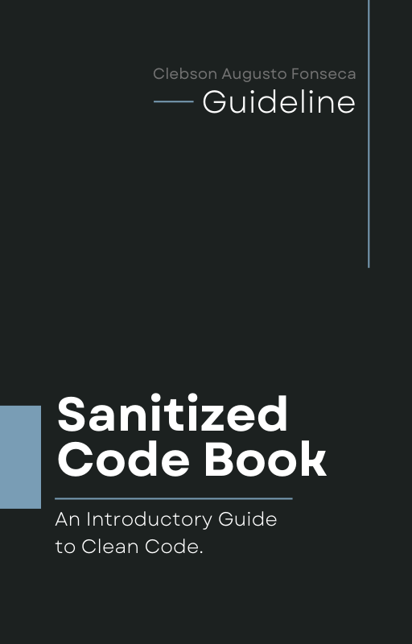

[pt-BR](README.pt-BR.md) | en-EN

<h1 align="center">Sanitized Code Book</h1>

    
    
    
    

## About

"Sanitized Code Book" is a collaborative introductory guide, available on GitHub, that provides developers with a clear understanding of the principles and practices related to clean code in software engineering. With practical examples, this book explores essential techniques for writing quality code that is easy to understand and maintain. Readers will learn how to improve code readability, structure, and organization according to specific conventions and standards.

The book covers how to examine variables and functions, code formatting and styling, dependency management, unit and integration testing, refactoring, creating reusable code, and functional programming best practices.

## Summary

- [1. Introduction](manuscript/Chapter_01/Introduction.md)
- [2. Clean Code Principles](#)
- [3. Testing and Code Quality](#)
- [4. Improving Code Readability](#)
- [5. Good Naming Practices](#)
- [6. Handling Errors and Exceptions](#)
- [7. Performance Optimization](#)
- [8. Resource Management](#)
- [9. Advanced Optimization Techniques](#)
- [10. Algorithm Optimization](#)
- [11. Good Data Handling Practices](#)
- [12. Performance Improvement in Web Environments](#)
- [13. Conclusion](#)

