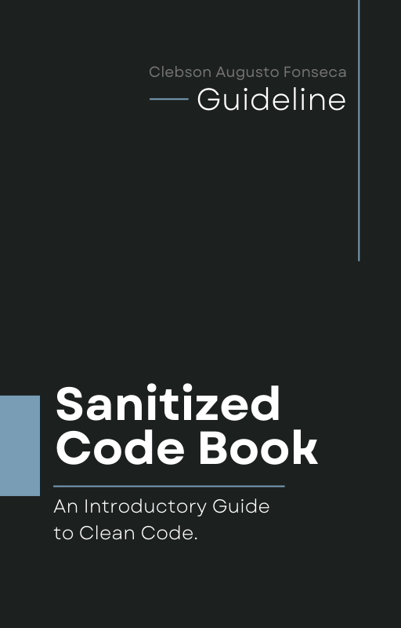

pt-BR | [en-EN](README.md)

<h1 align="center">Sanitized Code Book</h1>

    
    
    
    

## Sobre

"Sanitized Code Book" é um guia introdutório colaborativo, disponível no GitHub, que proporciona aos desenvolvedores uma compreensão clara dos princípios e práticas relacionadas a código limpo em engenharia de software. Com exemplos práticos, este livro explora técnicas essenciais para escrever código de qualidade que seja fácil de entender e manter. Os leitores aprenderão como melhorar a legibilidade, estrutura e organização do código utilizando convenções e padrões específicos.

O livro aborda tópicos como nomeação apropriada de variáveis e funções, formatação e estilo de código, gerenciamento de dependências, testes unitários e de integração, refatoração, criação de código reutilizável e melhores práticas de programação funcional.

## Sumário

- [1. Introdução](translations/pt-BR/manuscript/Chapter_01/Introduction.md)
- [2. Princípios de Código Limpo](#)
- [3. Testes e Qualidade de Código](#)
- [4. Melhorando a Legibilidade do Código](#)
- [5. Boas Práticas de Nomenclatura](#)
- [6. Tratando Erros e Exceções](#)
- [7. Otimização de Desempenho](#)
- [8. Gerenciamento de Recursos](#)
- [9. Técnicas Avançadas de Otimização](#)
- [10. Otimização de Algoritmos](#)
- [11. Boas Práticas de Manipulação de Dados](#)
- [12. Melhoria de Performance em Ambientes Web](#)
- [13. Conclusão](#)

